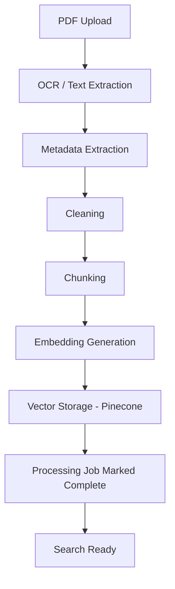
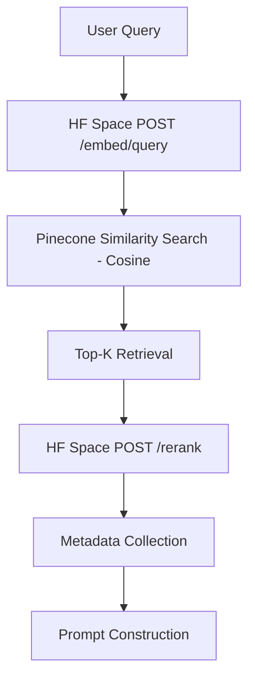
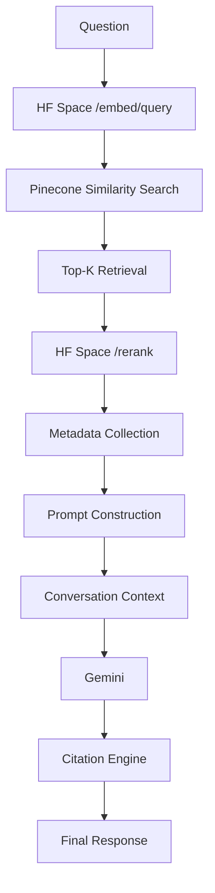

# RAG Pipeline

> **Basis:** This document is grounded directly in the source Architecture & Workflows specification (ingestion, retrieval, and chat sub-workflows). Chunking parameters, sub-workflow steps, and cross-module dependencies are taken from that document. The "why" explanations are added for clarity; ownership-scoping notes in the retrieval section are **PROPOSED DESIGN**.

## Part 1 — Ingestion Pipeline

| Stage | What it does | Why it exists |
|---|---|---|
| PDF Upload | Accepts the file, assigns a document ID | Establishes a stable identity for tracking status through every later stage |
| OCR / Text Extraction | Reads raw text and structure from the PDF | Legal PDFs are often scanned or mixed-layout; without OCR, text-layer extraction alone would miss content |
| Metadata Extraction | Captures source, page numbers, title, etc. | This is the data citations are built from later — losing it here means answers can't be traced back to a source |
| Cleaning | Normalizes whitespace, removes OCR artifacts/noise | Embedding quality degrades on noisy text; clean input produces more reliable similarity search |
| Chunking | Splits cleaned text into fixed-size segments | A recursive character text splitter breaks documents into **1000-character chunks with 200-character overlap** — small enough for precise retrieval, with overlap to avoid severing context across chunk boundaries |
| Embedding Generation | Sends chunks to the `legal-rag-embedding-service` (HF Space) | Generates dense vectors via `BAAI/bge-small-en-v1.5` over a dedicated HTTP API, saving backend memory and optimizing deployment |
| Vector Storage | Writes vectors + metadata into Pinecone | Makes chunks searchable via cosine similarity |
| Processing Job | Tracks status (`uploaded` → `extracting` → `chunked` → `processed` → `failed`) | Gives the frontend and API consumers visibility into long-running async processing |

**Source-specified intermediate outputs.** The original pipeline design persists intermediate state as JSONL files at each stage (`documents.jsonl` after extraction, `chunked_documents.jsonl` after chunking) before final vector storage. This provides a debug/replay trail if a later stage fails, so the pipeline can resume from the last successful stage rather than re-running OCR.

## Part 2 — Retrieval Pipeline

The retrieval module sends the incoming query to the HF embedding service, connects to the Pinecone store, runs a cosine similarity lookup to fetch the Top-K most relevant chunks, then **reranks them via the HF reranker service** (`POST /rerank`) before returning them to the chat layer with their metadata (source, page, chunk ID).

If the reranker service is temporarily unavailable, the pipeline falls back to the original Pinecone cosine-similarity ordering — the API remains available and returns a valid response.

## Part 3 — RAG Chat Pipeline

| Stage | Detail |
|---|---|
| Question | Raw user query received via `POST /api/v1/chat` |
| Embedding | Query is embedded with the same model used for chunk embeddings, so both live in the same vector space |
| Similarity Search / Top-K Retrieval | Handled by the retrieval module (Part 2) |
| Metadata Collection | Source, page number, and chunk ID are pulled from each retrieved chunk — required for citations |
| Prompt Construction | Combines the question, retrieved chunks, their metadata, and (if present) prior conversation history into a single instruction-formatted prompt for Gemini |
| Conversation Context | For multi-turn sessions, prior turns are gathered and folded into the prompt so follow-up questions resolve correctly |
| Gemini | Generates the natural-language answer grounded in the supplied context |
| Citation Engine | Maps statements in the response back to source file + page number, producing inline citations |
| Final Response | Answer + citations returned to the frontend |

### Query Rewriting

The chat module optionally rewrites follow-up queries using conversation history before retrieval — e.g., "what about clause 3?" is rewritten into a self-contained query using prior context, improving retrieval accuracy for conversational fragments.

## Related Documents

- [SYSTEM_ARCHITECTURE.md](./SYSTEM_ARCHITECTURE.md) — where this pipeline sits in the overall system
- [DATABASE_DESIGN.md](./DATABASE_DESIGN.md) — how documents, chunks, and jobs are modeled
- [API_DOCUMENTATION.md](./API_DOCUMENTATION.md) — endpoint reference for each stage
