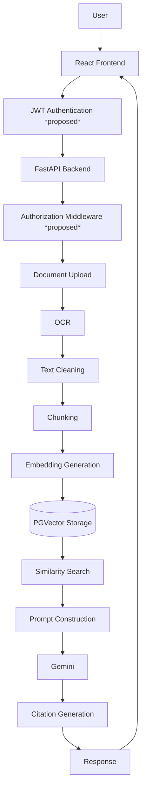
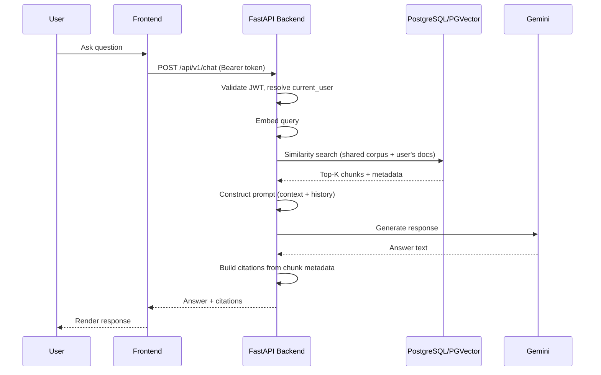

# System Architecture

> **Basis:** The pipeline flow (ingestion → retrieval → chat) is grounded in the source specifications. The auth/authorization layers wrapping it are **PROPOSED DESIGN**, added to reflect a single integrated, access-controlled backend rather than three open internal services.

## 1. Overview

Legal RAG System runs as **one FastAPI backend** serving a React frontend. It replaces what was originally specified as three separately-addressable services (ingestion, retrieval, chat — each with its own `/health` and duplicated `/documents` routes) with a single process, single database, and single set of endpoints. Internal calls between pipeline stages are now in-process function calls, not HTTP round-trips.

## 2. High-Level Flow

## 3. Component Responsibilities

| Component | Responsibility | Basis |
|---|---|---|
| React Frontend | Upload UI, chat UI, session/history views | Proposed (mentioned only as "Team D" in source) |
| JWT Authentication | Verifies identity on every request | Proposed |
| Authorization Middleware | Resolves `current_user`, enforces ownership | Proposed |
| Ingestion Pipeline | OCR → clean → chunk → embed → store | Source doc |
| Retrieval Module | Query embedding → PGVector cosine search → Top-K chunks | Source doc |
| RAG Chat Module | Prompt construction, Gemini call, citation generation, history | Source doc |
| PGVector Store | Vector index over document chunks | Source doc |

## 4. Why One Integrated Backend

The original three-service split (ingestion / retrieval / chat) required duplicated endpoints — each service independently exposed `GET /documents`, `DELETE /documents/{id}`, and `GET /health` — and Team C depended on an HTTP call to Team B's `/retrieve` endpoint for every chat turn. Consolidating into a single backend:

- Removes duplicate document-management endpoints (see [API_DOCUMENTATION.md](./API_DOCUMENTATION.md))
- Turns the chat → retrieval network hop into a direct function call, reducing latency
- Gives ownership/authorization a single enforcement point instead of three
- Simplifies deployment to one service instead of three independently versioned ones

## 5. Request Lifecycle

## 6. Related Documents

- [RAG_PIPELINE.md](./RAG_PIPELINE.md) — stage-by-stage pipeline detail
- [DATABASE_DESIGN.md](./DATABASE_DESIGN.md) — schema backing this architecture
- [SECURITY.md](./SECURITY.md) — how ownership is enforced at each layer
- [WORKFLOW_DIAGRAMS.md](./WORKFLOW_DIAGRAMS.md) — additional diagrams
