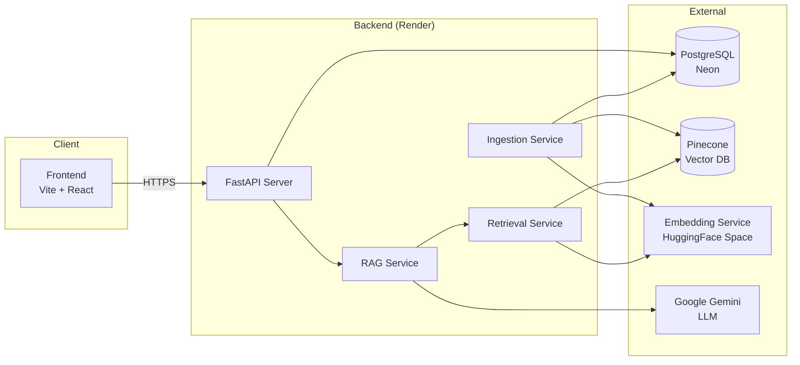
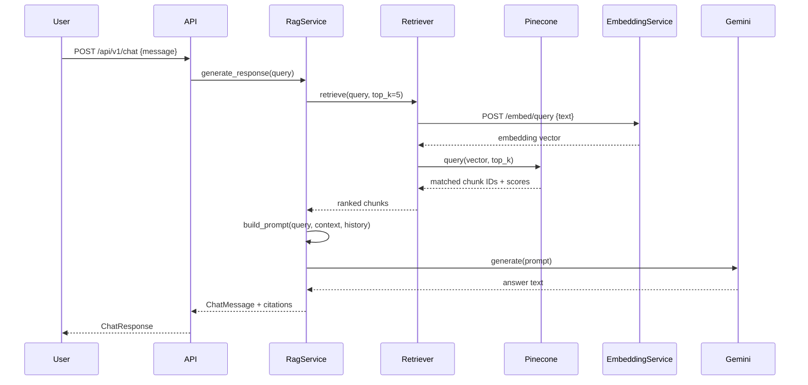

# Architecture

## High-Level System Overview

Legal RAG is a Retrieval-Augmented Generation system for Indian legal documents. Users upload legal PDFs, which are processed through an OCR → extraction → chunking → embedding pipeline. At query time, the system retrieves semantically relevant chunks from Pinecone, then generates answers using Google Gemini with citations.



## Backend Architecture

The backend follows a layered FastAPI architecture:

```
API Routes → Services → Repositories → Database
                ↓
          External Clients (Pinecone, Gemini, Embedding Service)
```

| Layer          | Responsibility                                            |
|----------------|-----------------------------------------------------------|
| `api/v1/`      | HTTP route handlers, request validation, auth enforcement |
| `services/`    | Business logic — RAG orchestration, retrieval, ingestion  |
| `repositories/`| Database CRUD operations via SQLAlchemy async sessions    |
| `models/`      | SQLAlchemy ORM models                                     |
| `schemas/`     | Pydantic request/response models                          |
| `core/`        | Settings, security (JWT/bcrypt), exception handlers       |
| `dependencies/`| FastAPI dependency injection (auth, DB sessions)          |

## RAG Pipeline



## Component Responsibilities

| Component               | Role                                                               |
|-------------------------|--------------------------------------------------------------------|
| **FastAPI Backend**     | REST API, auth, orchestration, DB access                           |
| **Retrieval Service**   | Embeds queries via HF service, searches Pinecone, returns chunks   |
| **RAG Service**         | Orchestrates retrieve → prompt → generate → cite pipeline          |
| **Ingestion Service**   | Processes uploads: OCR → extract → chunk → embed → store           |
| **Document Service**    | CRUD for documents, ownership checks                               |
| **Embedding Service**   | Standalone FastAPI microservice on HuggingFace Spaces (MiniLM-L6)  |
| **Pinecone**            | Stores and queries 384-dim embedding vectors                       |
| **PostgreSQL (Neon)**   | Stores users, documents, chunks, chat sessions, citations          |
| **Google Gemini**       | Generates natural-language answers from context + query             |

## External Dependencies

| Service                  | Purpose                | Connection                          |
|--------------------------|------------------------|-------------------------------------|
| PostgreSQL (Neon)        | Relational data store  | `DATABASE_URL` (asyncpg)            |
| Pinecone                 | Vector similarity      | `PINECONE_API_KEY` + `PINECONE_INDEX` |
| Google Gemini            | LLM generation         | `GEMINI_API_KEY`                    |
| HuggingFace Embedding    | Sentence embeddings    | `EMBEDDING_SERVICE_URL` + API key   |
