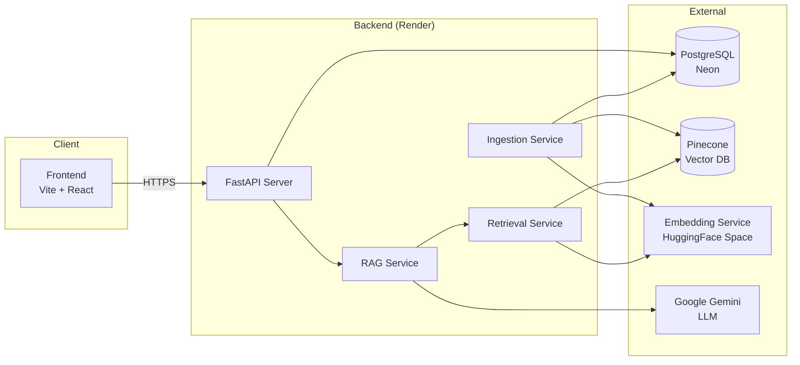
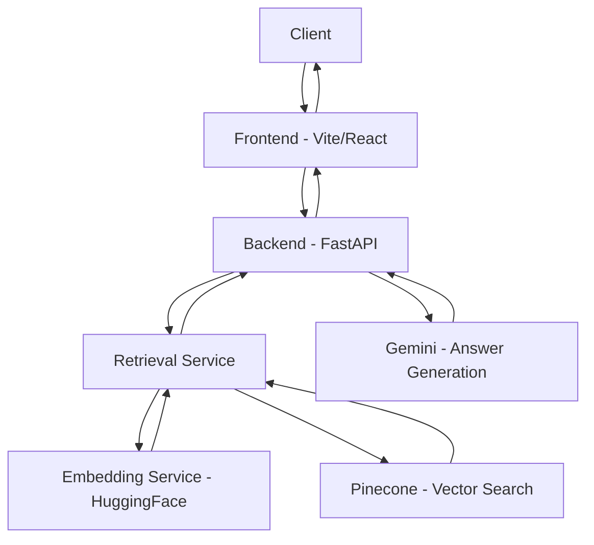
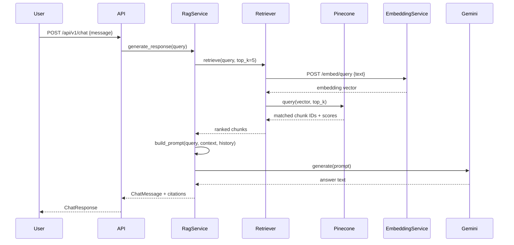

# Architecture

## Overview

Legal RAG is a production-grade Retrieval-Augmented Generation system built for Indian legal documents. The application follows a layered backend architecture where a FastAPI server orchestrates document ingestion, semantic retrieval via Pinecone, and answer generation via Google Gemini. The embedding model runs as an independent microservice on HuggingFace Spaces, keeping the backend lightweight and scalable.

## Design Principles

- **Separation of Concerns:** Each layer (API → Service → Repository → Database) has a single responsibility. Routes handle HTTP, services handle business logic, repositories handle persistence.
- **Modular Services:** RAG orchestration, retrieval, ingestion, and document management are independent services that can be modified without affecting each other.
- **Independent Microservices:** The embedding model runs as a standalone service on HuggingFace Spaces, decoupled from the backend lifecycle.
- **Async Architecture:** The backend uses `asyncpg` and async SQLAlchemy sessions throughout. CPU-bound operations (embedding, LLM calls) run in thread pool executors to avoid blocking the event loop.
- **Scalable Deployment:** Each service (frontend, backend, database, embedding, vector DB) is deployed independently and can scale on its own.

## High-Level System Overview



## Why External Embedding Service

The sentence embedding model (`all-MiniLM-L6-v2`) is hosted on HuggingFace Spaces as a separate Docker container instead of running inside the backend. This design decision was driven by:

- **Memory Reduction:** Loading ML models in the backend process would exceed Render's free-tier RAM limits. Offloading embeddings keeps backend memory under 512 MB.
- **Faster Backend Startup:** The backend starts in seconds without downloading and loading model weights. The embedding service pre-downloads the model at Docker build time.
- **Independent Scaling:** The embedding service can be scaled, restarted, or upgraded without affecting the backend or its database connections.
- **Render Limitations:** Render's free tier has strict memory constraints. Separating compute-heavy inference prevents OOM crashes during concurrent requests.

## Backend Architecture

The backend follows a layered FastAPI architecture:

```
API Routes → Services → Repositories → Database
                ↓
          External Clients (Pinecone, Gemini, Embedding Service)
```

| Layer          | Responsibility                                            |
|----------------|-----------------------------------------------------------|
| `api/v1/`      | HTTP route handlers, request validation, auth enforcement |
| `services/`    | Business logic — RAG orchestration, retrieval, ingestion  |
| `repositories/`| Database CRUD operations via SQLAlchemy async sessions    |
| `models/`      | SQLAlchemy ORM models                                     |
| `schemas/`     | Pydantic request/response models                          |
| `core/`        | Settings, security (JWT/bcrypt), exception handlers       |
| `dependencies/`| FastAPI dependency injection (auth, DB sessions)          |

## Request Lifecycle



## RAG Pipeline



## Component Responsibilities

| Component               | Role                                                               |
|-------------------------|--------------------------------------------------------------------|
| **Frontend**            | React SPA — user interface for chat, document upload, session management |
| **FastAPI Backend**     | REST API, auth, orchestration, DB access                           |
| **Retrieval Service**   | Embeds queries via HF service, searches Pinecone, returns chunks   |
| **RAG Service**         | Orchestrates retrieve → prompt → generate → cite pipeline          |
| **Ingestion Service**   | Processes uploads: OCR → extract → chunk → embed → store           |
| **Document Service**    | CRUD for documents, ownership checks                               |
| **Embedding Service**   | Standalone FastAPI microservice on HuggingFace Spaces (MiniLM-L6)  |
| **Pinecone**            | Stores and queries 384-dim embedding vectors                       |
| **PostgreSQL (Neon)**   | Stores users, documents, chunks, chat sessions, citations          |
| **Google Gemini**       | Generates natural-language answers from context + query             |

## External Dependencies

| Service                  | Purpose                | Connection                          |
|--------------------------|------------------------|-------------------------------------|
| PostgreSQL (Neon)        | Relational data store  | `DATABASE_URL` (asyncpg)            |
| Pinecone                 | Vector similarity      | `PINECONE_API_KEY` + `PINECONE_INDEX` |
| Google Gemini            | LLM generation         | `GEMINI_API_KEY`                    |
| HuggingFace Embedding    | Sentence embeddings    | `EMBEDDING_SERVICE_URL` + API key   |

## Scalability

- **Backend** remains lightweight (~512 MB RAM) because ML inference is offloaded to the embedding service.
- **Embedding Service** can be scaled independently on HuggingFace Spaces (or migrated to a GPU instance) without touching the backend.
- **Pinecone** is fully managed and serverless — scales automatically with query volume.
- **PostgreSQL (Neon)** supports connection pooling and autoscaling on the Neon platform.
- **Frontend** is deployed on Vercel's edge network with automatic global CDN distribution.

## Security

- **Authentication:** JWT tokens (HS256) with bcrypt password hashing. All protected endpoints verify token validity and user ownership.
- **Transport:** HTTPS enforced in production for all service-to-service and client-to-server communication.
- **API Keys:** The embedding service is protected by a bearer API key. Gemini and Pinecone use provider-issued API keys stored as environment variables, never committed to source control.
