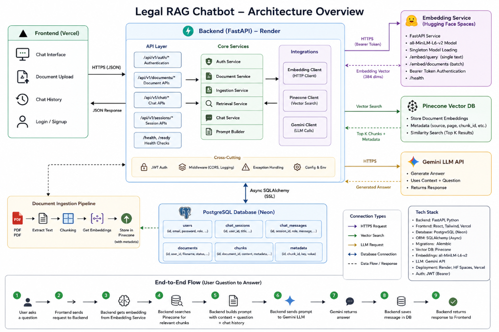
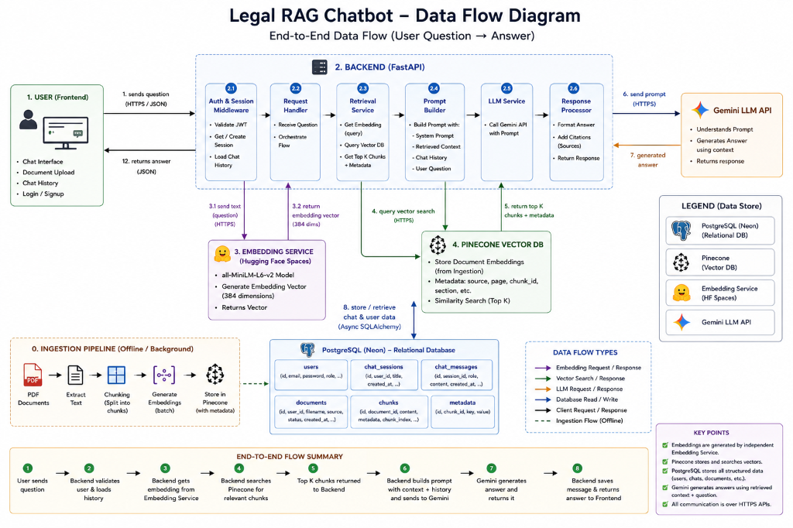

# Architecture Overview



## System Architecture

NyayaAI is a Legal RAG (Retrieval-Augmented Generation) system that enables users to upload legal documents, search through them semantically, and chat with an AI assistant that provides cited, context-aware answers grounded in the uploaded corpus.

```
┌─────────────────┐     ┌──────────────────────┐     ┌─────────────────┐
│   Frontend      │────▶│   Backend (FastAPI)   │────▶│   PostgreSQL    │
│   React + Vite  │◀────│   REST API            │◀────│   (Render)      │
│   (Vercel)      │     │   (Render)            │     └─────────────────┘
└─────────────────┘     └──────────┬───────────┘
                                   │
                        ┌──────────┴───────────┐
                        │                      │
                   ┌────▼────┐          ┌──────▼──────┐
                   │ Pinecone│          │ Google       │
                   │ VectorDB│          │ Gemini LLM   │
                   └─────────┘          └──────────────┘
```

## Component Architecture

### 1. Ingestion Pipeline (`legal-rag/extracted/`, `legal-rag/chunking/`, `legal-rag/ingestion/`)

**Purpose**: Convert raw legal documents into searchable chunks with metadata.

**Flow**:
```
PDF/Document → PDF Extraction (PyMuPDF) → Text Cleaning →
Chunking (LangChain) → Metadata Extraction → Embedding Generation →
Pinecone Upload
```

**Components**:
- `extracted/`: PDF extraction, text cleaning, metadata loading, and the full extraction pipeline
- `chunking/`: Configurable chunking with LangChain text splitters
- `ingestion/outputs/pinecone/`: Upload embeddings to Pinecone vector database

**Output**:
- Vectors stored in Pinecone with chunk text and metadata
- Document metadata stored in PostgreSQL

### 2. Retrieval Pipeline (`legal-rag/retrieval/`)

**Purpose**: Enable semantic search over ingested documents.

**Flow**:
```
User Query → Query Embedding (all-MiniLM-L6-v2) → Pinecone Vector Search →
Reranking (Cross-encoder) → Retrieved Documents → Return to Chat
```

**Components**:
- `embeddings/`: Sentence-Transformers embedding generation (default: `all-MiniLM-L6-v2`, 384 dimensions)
- `vectordb/pinecone_store.py`: Pinecone client for vector CRUD operations
- `search/retriever.py`: Semantic search with configurable top-k
- `reranker/`: Cross-encoder reranking for relevance
- `pipelines/retrieval_service.py`: Orchestrates the full retrieval workflow

### 3. Chat & Reasoning (`legal-rag/rag_chat/`)

**Purpose**: Generate accurate, cited responses using Google Gemini + retrieved context.

**Flow**:
```
Retrieved Documents + Query → Context Building → System Prompt Engineering →
Gemini LLM Generation → Citation Extraction → Response
```

**Components**:
- `llm/gemini_client.py`: Google Gemini API client via `google-genai` SDK
- `prompts/`: System prompts and history formatter for legal domain
- `citations/`: Citation extraction and metadata parsing from LLM output
- `workflows/`: RAG pipeline orchestration, context building, and retrieval connector

### 4. Frontend (`legal-rag/frontend/`)

**Purpose**: User interface for authentication, document upload, and chat.

**Technology**: React 19 + Vite + Tailwind CSS v4 + React Router v7

**Deployment**: Vercel (https://samarth-internship-2026-rag-chatbot.vercel.app)

**Pages & Routes**:
| Route               | Page             | Description                        |
| ------------------- | ---------------- | ---------------------------------- |
| `/`                 | Login            | User authentication                |
| `/signup`           | Signup           | New user registration              |
| `/dashboard`        | Dashboard        | Stats overview and hero card       |
| `/chat`             | Chat             | AI chat with RAG-powered responses |
| `/upload-documents` | Upload Documents | Document upload interface          |
| `/compare`          | Case Comparison  | Side-by-side case comparison       |
| `/settings`         | Settings         | User preferences and theme toggle  |

**Key Components**:
- `components/chat/`: ChatWindow, ChatInput, ChatHeader, MessageBubble, ConversationList
- `components/dashboard/`: HeroCard
- `components/layout/`: Navbar with responsive sidebar navigation
- `context/`: AuthContext (JWT auth), ThemeContext (dark/light mode)
- `services/api.js`: Axios-based API client pointing to backend

### 5. Backend API (`legal-rag/backend/`)

**Purpose**: REST API orchestrating authentication, document management, retrieval, and chat.

**Technology**: Python, FastAPI, Pydantic, SQLAlchemy (async), Alembic

**Deployment**: Render (https://legal-rag-backend-zf50.onrender.com)

**API Prefix**: `/api/v1`

**Route Groups**:
- `/api/v1/auth` — JWT-based authentication (login, signup, token refresh)
- `/api/v1/documents` — Document upload, listing, details, processing status
- `/api/v1/extraction` — Manual re-trigger of ingestion pipeline
- `/api/v1/retrieval` — Semantic similarity search over chunks
- `/api/v1/chat` — RAG-powered chat, session management, query rewriting
- `/health` — Liveness probe
- `/ready` — Readiness probe (includes DB connectivity check)

**Structure**:
```
backend/
├── app/
│   ├── main.py              # FastAPI app factory with CORS, lifespan, error handlers
│   ├── api/v1/              # Route handlers (auth, chat, documents, extraction, retrieval)
│   ├── schemas/             # Pydantic request/response models
│   ├── services/            # Business logic (vector/pinecone_service)
│   ├── core/                # Settings, exceptions, logging
│   ├── database/            # SQLAlchemy session and engine
│   ├── dependencies/        # Auth dependency injection
│   └── models/              # SQLAlchemy ORM models
├── alembic/                 # Database migrations
├── Dockerfile               # Multi-stage production Dockerfile
└── requirements.txt         # Python dependencies
```

## Data Flow



### Document Ingestion Flow

```
1. User uploads PDF via Frontend (/upload-documents)
   ↓
2. Backend receives file via POST /api/v1/documents/upload
   ↓
3. Extraction Pipeline processes:
   - PDF extraction (PyMuPDF)
   - Text cleaning and normalization
   - Metadata loading
   ↓
4. Chunking Pipeline:
   - LangChain text splitting (configurable chunk size/overlap)
   ↓
5. Embeddings generated using Sentence-Transformers (all-MiniLM-L6-v2)
   ↓
6. Vectors + metadata uploaded to Pinecone
   ↓
7. Document metadata stored in PostgreSQL
   ↓
8. Frontend shows success, updates document list
```

### Query/Response Flow

```
1. User asks question in chat (/chat)
   ↓
2. Backend receives message via POST /api/v1/chat
   ↓
3. Query embedded using Sentence-Transformers
   ↓
4. Semantic search in Pinecone (top-k configurable, default 5)
   ↓
5. Retrieved chunks reranked for relevance (cross-encoder)
   ↓
6. Top chunks + system prompt + chat history sent to Google Gemini
   ↓
7. Gemini generates response with citations
   ↓
8. Citations parsed and formatted
   ↓
9. Response + citations returned to Frontend
   ↓
10. Frontend displays message with source references
```

## Database Schema

### PostgreSQL (Metadata & Auth)

```sql
-- Users (Authentication)
users (id, email, hashed_password, created_at)

-- Documents
documents (id, title, filename, file_type, file_path,
           court, case_number, judgment_date, source, language,
           created_at, updated_at)

-- Chunks
chunks (id, document_id, content, page_number, section, paragraph,
        chunk_index, created_at)

-- Processing Jobs
processing_jobs (id, document_id, stage, status, error_message,
                 started_at, completed_at)

-- Chat Sessions & Messages
chat_sessions (id, title, created_at, updated_at)
chat_messages (id, session_id, role, content, created_at)

-- Citations
citations (id, message_id, chunk_id, score)
```

### Pinecone (Vector Storage)

```json
{
  "id": "chunk_12345",
  "values": [0.123, 0.456, ...],
  "metadata": {
    "document_id": "doc_123",
    "document_name": "Contract_A.pdf",
    "chunk_index": 5,
    "page_number": 2,
    "text": "...chunk text...",
    "document_type": "contract"
  }
}
```

## Technology Stack

| Layer      | Technology                                              |
| ---------- | ------------------------------------------------------- |
| Frontend   | React 19, Vite 8, Tailwind CSS v4, React Router v7      |
| Backend    | Python 3.13, FastAPI, Pydantic v2, SQLAlchemy 2 (async) |
| Database   | PostgreSQL (Render managed)                             |
| Vector DB  | Pinecone                                                |
| Embeddings | Sentence-Transformers `all-MiniLM-L6-v2` (384-dim)      |
| LLM        | Google Gemini (via `google-genai` SDK)                  |
| Auth       | JWT (python-jose), bcrypt (passlib)                     |
| Hosting    | Frontend: Vercel, Backend: Render                       |
| Containers | Docker, Docker Compose                                  |

## Security

1. **API Authentication**: JWT tokens via `/api/v1/auth` endpoints
2. **Password Hashing**: bcrypt via passlib
3. **CORS**: Explicit origin allowlist (localhost + Vercel deployments)
4. **Input Validation**: Pydantic schema validation on all endpoints
5. **Error Handling**: Custom exception handlers (no stack traces leaked to client)
6. **Frontend Security Headers**: X-Frame-Options, X-XSS-Protection, X-Content-Type-Options (via Nginx for Docker deployments)

## Deployment Architecture

```
┌─────────────┐        ┌───────────────┐        ┌──────────────┐
│   GitHub    │───push──▶   Vercel     │        │   Render     │
│   main      │         │   (Frontend) │        │   (Backend)  │
│   branch    │───push──▶──────────────│        │──────────────│
└─────────────┘         │  React SPA   │──API──▶│  FastAPI     │
                        │  vercel.json │        │  Dockerfile  │
                        └───────────────┘        └──────┬───────┘
                                                        │
                                        ┌───────────────┼───────────────┐
                                        │               │               │
                                   ┌────▼────┐   ┌──────▼──────┐  ┌────▼────┐
                                   │PostgreSQL│   │  Pinecone   │  │ Gemini  │
                                   │ (Render) │   │  (Cloud)    │  │  API    │
                                   └──────────┘   └─────────────┘  └─────────┘
```
