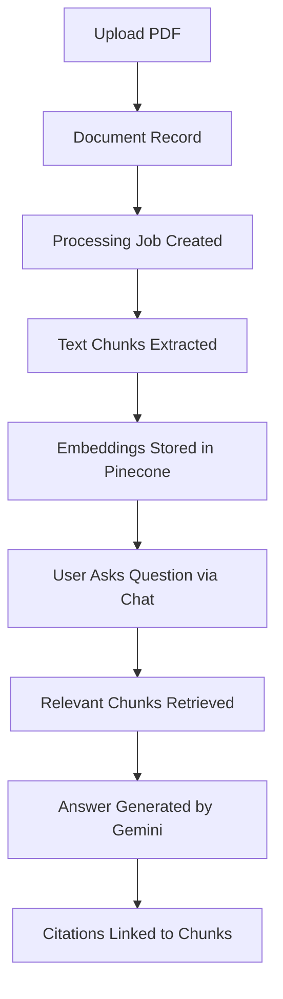
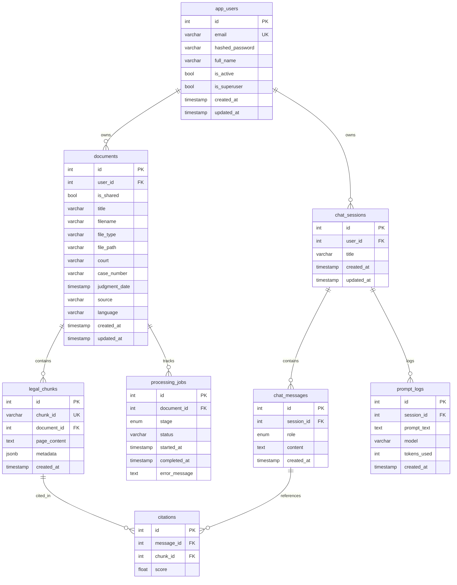

# Database Schema

## Overview

PostgreSQL (hosted on Neon) stores all relational data: users, document metadata, text chunks, chat sessions, messages, citations, processing jobs, and prompt audit logs. Vector embeddings are stored separately in Pinecone. The async driver is `asyncpg`, and schema migrations are managed by Alembic.

## Design Principles

- **Normalized Schema:** Data is organized into purpose-specific tables with no redundancy. Each table has a single responsibility.
- **Foreign Keys:** All relationships are enforced at the database level with proper `ON DELETE` behavior (CASCADE or SET NULL).
- **Cascade Delete:** Deleting a user cascades to their documents, chat sessions, and all related child records. This prevents orphaned data.
- **Async ORM:** All database access uses SQLAlchemy's async session (`AsyncSession`) with `asyncpg` for non-blocking I/O.
- **Alembic Migrations:** Schema changes are version-controlled. Migrations run automatically at backend startup via `entrypoint.sh`.

## Data Lifecycle



## Processing Pipeline Stages

The `processing_jobs.stage` enum tracks document processing through these stages:

```
UPLOADED → OCR → EXTRACTION → CLEANING → CHUNKING → EMBEDDING → COMPLETED
                                                                    ↓
                                                                  FAILED
```

| Stage        | Description                                          |
|--------------|------------------------------------------------------|
| `UPLOADED`   | Document file saved to storage                       |
| `OCR`        | Optical character recognition on scanned documents   |
| `EXTRACTION` | Text and metadata extracted from the document        |
| `CLEANING`   | Text cleaned and normalized                          |
| `CHUNKING`   | Text split into overlapping chunks                   |
| `EMBEDDING`  | Chunk embeddings generated and stored in Pinecone    |
| `COMPLETED`  | Pipeline finished successfully                       |
| `FAILED`     | Pipeline failed at any stage (error recorded)        |

## ER Diagram



---

## Tables

### `app_users`

Stores registered user accounts.

| Column            | Type         | Notes                     |
|-------------------|--------------|---------------------------|
| `id`              | `int` PK     | Auto-increment            |
| `email`           | `varchar(255)` | Unique, indexed         |
| `hashed_password` | `varchar(255)` | bcrypt hash             |
| `full_name`       | `varchar(255)` | Optional                |
| `is_active`       | `bool`       | Default `true`            |
| `is_superuser`    | `bool`       | Default `false`           |
| `created_at`      | `timestamp`  |                           |
| `updated_at`      | `timestamp`  |                           |

**Relationships:** → `documents`, `chat_sessions` (cascade delete)

---

### `documents`

Stores uploaded legal document metadata.

| Column          | Type           | Notes                          |
|-----------------|----------------|--------------------------------|
| `id`            | `int` PK       | Auto-increment                 |
| `user_id`       | `int` FK       | → `app_users.id` (CASCADE)    |
| `is_shared`     | `bool`         | Default `false`                |
| `title`         | `varchar(255)` | Required                       |
| `filename`      | `varchar(255)` | Original filename              |
| `file_type`     | `varchar(50)`  | MIME type                      |
| `file_path`     | `varchar(512)` | Storage path                   |
| `court`         | `varchar(255)` | Court name                     |
| `case_number`   | `varchar(100)` | Case identifier                |
| `judgment_date` | `timestamp`    | Date of judgment               |
| `source`        | `varchar(255)` | Source of document             |
| `language`      | `varchar(50)`  | Language code                  |

**Relationships:** → `legal_chunks`, `processing_jobs` (cascade delete)

---

### `legal_chunks`

Stores text chunks extracted from documents. Embeddings are stored externally in Pinecone.

| Column        | Type           | Notes                            |
|---------------|----------------|----------------------------------|
| `id`          | `int` PK       | Auto-increment                   |
| `chunk_id`    | `varchar(255)` | Unique external identifier       |
| `document_id` | `int` FK       | → `documents.id` (CASCADE)      |
| `page_content`| `text`         | Chunk text content               |
| `metadata`    | `jsonb`        | Flexible metadata (source, page) |

**Relationships:** → `citations`

---

### `processing_jobs`

Tracks document processing pipeline stages.

| Column          | Type           | Notes                                                  |
|-----------------|----------------|--------------------------------------------------------|
| `id`            | `int` PK       |                                                        |
| `document_id`   | `int` FK       | → `documents.id` (CASCADE)                            |
| `stage`         | `enum`         | `UPLOADED` `OCR` `EXTRACTION` `CLEANING` `CHUNKING` `EMBEDDING` `COMPLETED` `FAILED` |
| `status`        | `varchar(50)`  | `pending` / `in_progress` / `completed` / `failed`    |
| `error_message` | `text`         | Error details on failure                               |

---

### `chat_sessions`

Groups chat messages into conversations.

| Column     | Type           | Notes                       |
|------------|----------------|-----------------------------|
| `id`       | `int` PK       |                             |
| `user_id`  | `int` FK       | → `app_users.id` (CASCADE) |
| `title`    | `varchar(255)` | Session title               |

**Relationships:** → `chat_messages`, `prompt_logs` (cascade delete)

---

### `chat_messages`

Stores individual messages in a chat session.

| Column       | Type      | Notes                           |
|--------------|-----------|---------------------------------|
| `id`         | `int` PK  |                                |
| `session_id` | `int` FK  | → `chat_sessions.id` (CASCADE)|
| `role`       | `enum`    | `user` / `assistant` / `system`|
| `content`    | `text`    | Message text                   |

**Relationships:** → `citations` (cascade delete)

---

### `citations`

Links chat messages to the source chunks used for generating the response.

| Column       | Type      | Notes                              |
|--------------|-----------|------------------------------------|
| `id`         | `int` PK  |                                   |
| `message_id` | `int` FK  | → `chat_messages.id` (CASCADE)   |
| `chunk_id`   | `int` FK  | → `legal_chunks.id` (SET NULL)   |
| `score`      | `float`   | Relevance score                   |

---

### `prompt_logs`

Audit log of prompts sent to the LLM. Used for debugging, cost tracking, and monitoring token usage per session.

| Column        | Type           | Notes                           |
|---------------|----------------|---------------------------------|
| `id`          | `int` PK       |                                |
| `session_id`  | `int` FK       | → `chat_sessions.id` (CASCADE)|
| `prompt_text` | `text`         | Full prompt text               |
| `model`       | `varchar(100)` | Model name used                |
| `tokens_used` | `int`          | Token count                    |

---

## JSONB Metadata

The `legal_chunks.metadata` column uses PostgreSQL's `JSONB` type instead of fixed columns. This allows flexible, schema-less storage of chunk-level attributes (e.g., `source`, `page`, `section`, `doc_id`) that may vary across documents without requiring schema migrations.

## Indexed Columns

The following columns are indexed for query performance:

| Table            | Column       | Index Type  |
|------------------|--------------|-------------|
| `app_users`      | `id`         | Primary Key |
| `app_users`      | `email`      | Unique      |
| `documents`      | `id`         | Primary Key |
| `documents`      | `user_id`    | Foreign Key |
| `legal_chunks`   | `id`         | Primary Key |
| `legal_chunks`   | `chunk_id`   | Unique      |
| `chat_sessions`  | `user_id`    | Foreign Key |

## Vector Storage

Embedding vectors (384 dimensions, `all-MiniLM-L6-v2`) are stored in **Pinecone** rather than PostgreSQL. This design avoids the overhead of `pgvector` extensions, leverages Pinecone's optimized ANN (Approximate Nearest Neighbor) search, and keeps the PostgreSQL instance lightweight for relational queries only.

## Cascade Behaviour

| Parent Table     | Child Table       | On Delete  |
|------------------|-------------------|------------|
| `app_users`      | `documents`       | CASCADE    |
| `app_users`      | `chat_sessions`   | CASCADE    |
| `documents`      | `legal_chunks`    | CASCADE    |
| `documents`      | `processing_jobs` | CASCADE    |
| `chat_sessions`  | `chat_messages`   | CASCADE    |
| `chat_sessions`  | `prompt_logs`     | CASCADE    |
| `chat_messages`  | `citations`       | CASCADE    |
| `legal_chunks`   | `citations`       | SET NULL   |

Deleting a user removes all their documents, chat sessions, messages, and associated records. Deleting a chunk sets the citation's `chunk_id` to NULL (preserving the citation record for audit purposes).
