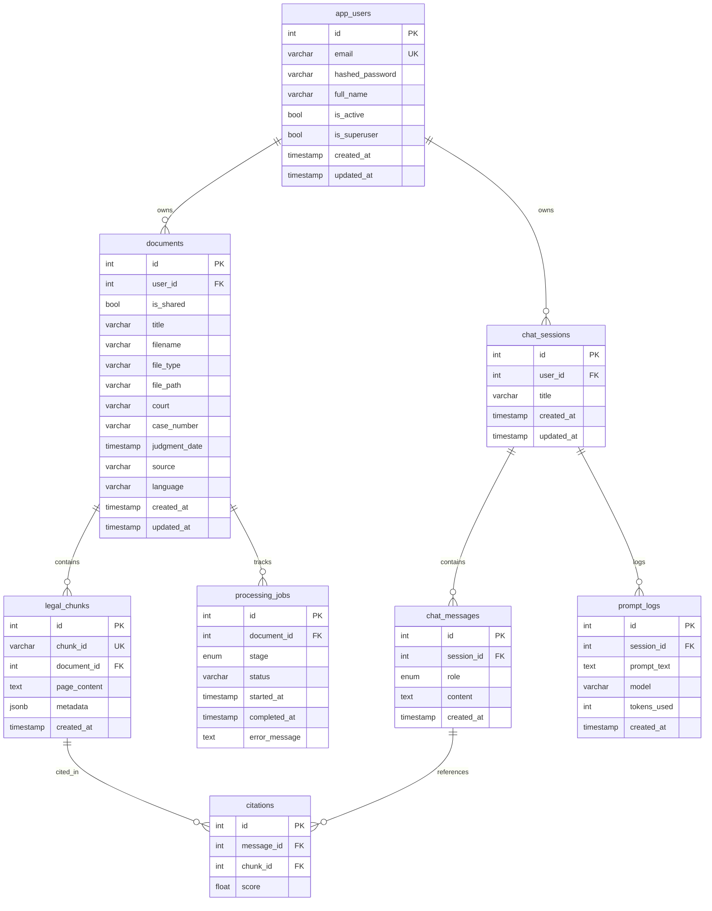

# Database Schema

All tables are managed by Alembic migrations and use PostgreSQL (Neon). The async driver is `asyncpg`.

## ER Diagram

---

## Tables

### `app_users`

Stores registered user accounts.

| Column            | Type         | Notes                     |
|-------------------|--------------|---------------------------|
| `id`              | `int` PK     | Auto-increment            |
| `email`           | `varchar(255)` | Unique, indexed         |
| `hashed_password` | `varchar(255)` | bcrypt hash             |
| `full_name`       | `varchar(255)` | Optional                |
| `is_active`       | `bool`       | Default `true`            |
| `is_superuser`    | `bool`       | Default `false`           |
| `created_at`      | `timestamp`  |                           |
| `updated_at`      | `timestamp`  |                           |

**Relationships:** → `documents`, `chat_sessions` (cascade delete)

---

### `documents`

Stores uploaded legal document metadata.

| Column          | Type           | Notes                          |
|-----------------|----------------|--------------------------------|
| `id`            | `int` PK       | Auto-increment                 |
| `user_id`       | `int` FK       | → `app_users.id` (CASCADE)    |
| `is_shared`     | `bool`         | Default `false`                |
| `title`         | `varchar(255)` | Required                       |
| `filename`      | `varchar(255)` | Original filename              |
| `file_type`     | `varchar(50)`  | MIME type                      |
| `file_path`     | `varchar(512)` | Storage path                   |
| `court`         | `varchar(255)` | Court name                     |
| `case_number`   | `varchar(100)` | Case identifier                |
| `judgment_date` | `timestamp`    | Date of judgment               |
| `source`        | `varchar(255)` | Source of document             |
| `language`      | `varchar(50)`  | Language code                  |

**Relationships:** → `legal_chunks`, `processing_jobs` (cascade delete)

---

### `legal_chunks`

Stores text chunks extracted from documents. Embeddings are stored externally in Pinecone.

| Column        | Type           | Notes                            |
|---------------|----------------|----------------------------------|
| `id`          | `int` PK       | Auto-increment                   |
| `chunk_id`    | `varchar(255)` | Unique external identifier       |
| `document_id` | `int` FK       | → `documents.id` (CASCADE)      |
| `page_content`| `text`         | Chunk text content               |
| `metadata`    | `jsonb`        | Flexible metadata (source, page) |

**Relationships:** → `citations`

---

### `processing_jobs`

Tracks document processing pipeline stages.

| Column          | Type           | Notes                                                  |
|-----------------|----------------|--------------------------------------------------------|
| `id`            | `int` PK       |                                                        |
| `document_id`   | `int` FK       | → `documents.id` (CASCADE)                            |
| `stage`         | `enum`         | `UPLOADED` `OCR` `EXTRACTION` `CLEANING` `CHUNKING` `EMBEDDING` `COMPLETED` `FAILED` |
| `status`        | `varchar(50)`  | `pending` / `in_progress` / `completed` / `failed`    |
| `error_message` | `text`         | Error details on failure                               |

---

### `chat_sessions`

Groups chat messages into conversations.

| Column     | Type           | Notes                       |
|------------|----------------|-----------------------------|
| `id`       | `int` PK       |                             |
| `user_id`  | `int` FK       | → `app_users.id` (CASCADE) |
| `title`    | `varchar(255)` | Session title               |

**Relationships:** → `chat_messages`, `prompt_logs` (cascade delete)

---

### `chat_messages`

Stores individual messages in a chat session.

| Column       | Type      | Notes                           |
|--------------|-----------|---------------------------------|
| `id`         | `int` PK  |                                |
| `session_id` | `int` FK  | → `chat_sessions.id` (CASCADE)|
| `role`       | `enum`    | `user` / `assistant` / `system`|
| `content`    | `text`    | Message text                   |

**Relationships:** → `citations` (cascade delete)

---

### `citations`

Links chat messages to the source chunks used for generating the response.

| Column       | Type      | Notes                              |
|--------------|-----------|------------------------------------|
| `id`         | `int` PK  |                                   |
| `message_id` | `int` FK  | → `chat_messages.id` (CASCADE)   |
| `chunk_id`   | `int` FK  | → `legal_chunks.id` (SET NULL)   |
| `score`      | `float`   | Relevance score                   |

---

### `prompt_logs`

Audit log of prompts sent to the LLM.

| Column        | Type           | Notes                           |
|---------------|----------------|---------------------------------|
| `id`          | `int` PK       |                                |
| `session_id`  | `int` FK       | → `chat_sessions.id` (CASCADE)|
| `prompt_text` | `text`         | Full prompt text               |
| `model`       | `varchar(100)` | Model name used                |
| `tokens_used` | `int`          | Token count                    |
