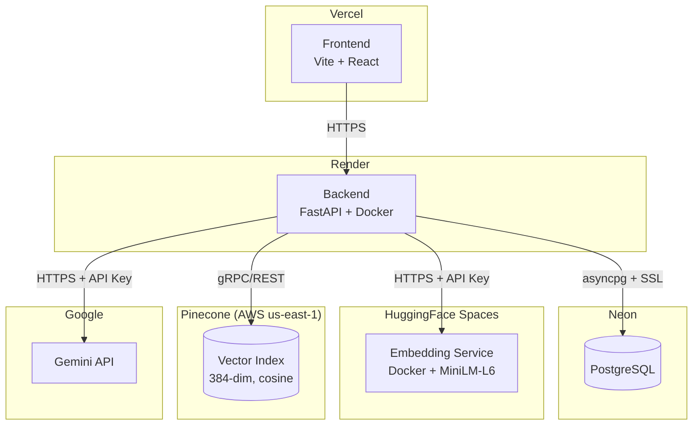

# Deployment

## Deployment Architecture



## Services

| Service                    | Platform              | URL / Host                                    |
|----------------------------|-----------------------|-----------------------------------------------|
| **Frontend**               | Vercel                | `samarth-internship-2026-rag-chatbot.vercel.app` |
| **Backend**                | Render (Docker)       | Configured via `render.yaml`                  |
| **PostgreSQL**             | Neon                  | `ep-shiny-fog-*.neon.tech`                    |
| **Vector DB**              | Pinecone (Serverless) | Index: `legal-rag`, Region: `us-east-1`       |
| **Embedding Service**      | HuggingFace Spaces    | `https://yashmit-legal-rag.hf.space`          |
| **LLM**                   | Google Gemini API     | Model: `gemini-2.5-flash`                     |

## Deployment Flow

Deploy services in this order to satisfy dependencies:

```
1. HuggingFace Embedding Service  (no dependencies)
2. PostgreSQL (Neon)               (provision database)
3. Backend (Render)                (depends on 1 + 2 + Pinecone + Gemini)
4. Frontend (Vercel)               (depends on 3)
```

### 1. HuggingFace Embedding Service

- Push `legal-rag-embedding-service/` to HuggingFace Space (Docker SDK).
- The Dockerfile pre-downloads the `all-MiniLM-L6-v2` model at build time.
- Set `EMBEDDING_SERVICE_API_KEY` as a Space secret.
- Runs on port `7860`.

### 2. PostgreSQL (Neon)

- Database is provisioned on Neon with a pooled connection endpoint.
- SSL is required (`ssl=true` in the connection string).
- Schema is applied automatically via Alembic migrations at backend startup.

### 3. Backend (Render)

- Defined in `render.yaml` (Infrastructure as Code).
- Docker build context is the repo root; Dockerfile is at `backend/Dockerfile`.
- The `entrypoint.sh` script runs: wait for DB → Alembic migrations → corpus seed → start Uvicorn.
- Set secrets (`DATABASE_URL`, `GEMINI_API_KEY`, `PINECONE_API_KEY`) in the Render Dashboard.

### 4. Frontend (Vercel)

- Deployed from `frontend/` directory.
- Set `VITE_API_URL` to the Render backend URL.
- `vercel.json` configures SPA routing rewrites.

---

## Required Environment Variables

### Backend (Render)

| Variable                       | Required | Description                          |
|--------------------------------|----------|--------------------------------------|
| `ENVIRONMENT`                  | Yes      | `production` or `development`        |
| `DEBUG`                        | No       | `true`/`false` (default: `true`)     |
| `DATABASE_URL`                 | Yes      | PostgreSQL connection string         |
| `SECRET_KEY`                   | Yes      | JWT signing key                      |
| `ALGORITHM`                    | No       | JWT algorithm (default: `HS256`)     |
| `ACCESS_TOKEN_EXPIRE_MINUTES`  | No       | Token TTL (default: `60`)            |
| `PINECONE_API_KEY`             | Yes      | Pinecone API key                     |
| `PINECONE_INDEX`               | Yes      | Pinecone index name                  |
| `PINECONE_NAMESPACE`           | No       | Namespace (default: `default`)       |
| `GEMINI_API_KEY`               | Yes      | Google Gemini API key                |
| `GEMINI_MODEL`                 | No       | Model name (default: `gemini-2.5-flash`) |
| `EMBEDDING_SERVICE_URL`        | No       | HF Space URL (default: `http://localhost:7860`) |
| `EMBEDDING_SERVICE_API_KEY`    | No       | API key for embedding service        |
| `SEED_CORPUS`                  | No       | Auto-seed corpus on startup (default: `true`) |
| `STORAGE_DIR`                  | No       | Upload directory (default: `./data/uploads`) |
| `CHUNK_SIZE`                   | No       | Chunking token size (default: `500`) |
| `CHUNK_OVERLAP`                | No       | Chunk overlap (default: `50`)        |

### Embedding Service (HuggingFace)

| Variable                     | Required | Description                    |
|------------------------------|----------|--------------------------------|
| `EMBEDDING_SERVICE_API_KEY`  | Yes      | API key for bearer auth        |
| `MODEL_NAME`                 | No       | Model (default: `all-MiniLM-L6-v2`) |
| `PORT`                       | No       | Server port (default: `7860`)  |

### Frontend (Vercel)

| Variable          | Required | Description                    |
|-------------------|----------|--------------------------------|
| `VITE_API_URL`    | Yes      | Backend base URL               |

---

## Health Checks

### `GET /health`

Liveness probe. Returns `200` immediately if the process is running.

```json
{ "status": "ok", "project": "Legal RAG API" }
```

### `GET /ready`

Readiness probe. Verifies connectivity to all three dependencies:

| Component           | Check                                        |
|---------------------|----------------------------------------------|
| PostgreSQL          | `SELECT 1` via asyncpg                       |
| Pinecone            | Index health status check                    |
| Embedding Service   | `GET /health` returns `status: "healthy"`    |

Returns `200` if all healthy, `503` with failure details otherwise.
