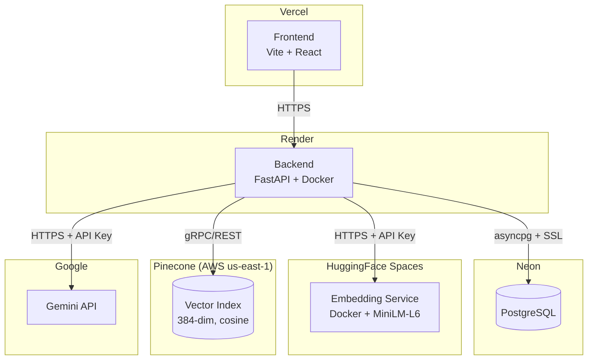
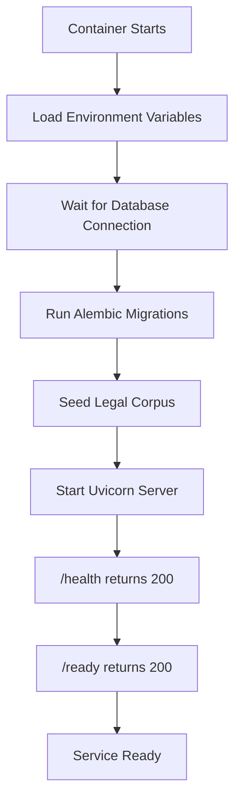

# Deployment

## Overview

The Legal RAG system uses a distributed deployment architecture where each service runs on a platform optimized for its workload. The frontend is served from Vercel's edge network, the backend runs as a Docker container on Render, the database is a managed PostgreSQL instance on Neon, embeddings are served from a HuggingFace Space, and vector search is handled by Pinecone's serverless infrastructure.

## Why This Architecture

| Service              | Platform        | Reason                                                       |
|----------------------|-----------------|--------------------------------------------------------------|
| **Frontend**         | Vercel          | Zero-config deployment, global CDN, automatic HTTPS          |
| **Backend**          | Render          | Docker support, free tier, auto-deploy from GitHub           |
| **Database**         | Neon            | Serverless PostgreSQL, connection pooling, auto-suspend       |
| **Vector DB**        | Pinecone        | Managed ANN search, serverless scaling, no infrastructure    |
| **Embedding Service**| HuggingFace     | Free GPU/CPU inference, Docker Spaces, isolated from backend |
| **LLM**             | Google Gemini   | Managed API, no infrastructure, pay-per-use                  |

This separation ensures each component can be deployed, scaled, and debugged independently.

## Deployment Architecture



## Services

| Service                    | Platform              | URL / Host                                    |
|----------------------------|-----------------------|-----------------------------------------------|
| **Frontend**               | Vercel                | `samarth-internship-2026-rag-chatbot.vercel.app` |
| **Backend**                | Render (Docker)       | Configured via `render.yaml`                  |
| **PostgreSQL**             | Neon                  | `ep-shiny-fog-*.neon.tech`                    |
| **Vector DB**              | Pinecone (Serverless) | Index: `legal-rag`, Region: `us-east-1`       |
| **Embedding Service**      | HuggingFace Spaces    | `https://yashmit-legal-rag.hf.space`          |
| **LLM**                   | Google Gemini API     | Model: `gemini-2.5-flash`                     |

## Containerization

The backend and embedding service are both containerized with Docker:

- **Reproducible Builds:** Dockerfiles pin Python versions and install all dependencies at build time, ensuring identical behavior across development and production.
- **Isolated Dependencies:** Each service has its own `requirements.txt` and runtime environment. The embedding service uses `python:3.11-slim`; the backend uses `python:3.12-slim`.
- **Pre-built Models:** The embedding service Dockerfile runs `RUN python -c "from sentence_transformers import SentenceTransformer; SentenceTransformer('all-MiniLM-L6-v2')"` during build to avoid download latency at startup.

## Deployment Flow

Deploy services in this order to satisfy dependencies:

```
1. HuggingFace Embedding Service  (no dependencies)
2. PostgreSQL (Neon)               (provision database)
3. Backend (Render)                (depends on 1 + 2 + Pinecone + Gemini)
4. Frontend (Vercel)               (depends on 3)
```

### 1. HuggingFace Embedding Service

- Push `legal-rag-embedding-service/` to HuggingFace Space (Docker SDK).
- The Dockerfile pre-downloads the `all-MiniLM-L6-v2` model at build time.
- Set `EMBEDDING_SERVICE_API_KEY` as a Space secret.
- Runs on port `7860`.

### 2. PostgreSQL (Neon)

- Database is provisioned on Neon with a pooled connection endpoint.
- SSL is required (`ssl=true` in the connection string).
- Schema is applied automatically via Alembic migrations at backend startup.

### 3. Backend (Render)

- Defined in `render.yaml` (Infrastructure as Code).
- Docker build context is the repo root; Dockerfile is at `backend/Dockerfile`.
- The `entrypoint.sh` script runs: wait for DB → Alembic migrations → corpus seed → start Uvicorn.
- Set secrets (`DATABASE_URL`, `GEMINI_API_KEY`, `PINECONE_API_KEY`) in the Render Dashboard.

### 4. Frontend (Vercel)

- Deployed from `frontend/` directory.
- Set `VITE_API_URL` to the Render backend URL.
- `vercel.json` configures SPA routing rewrites.

## Startup Sequence

The backend container follows this startup sequence defined in `entrypoint.sh`:



If the database is unreachable after 30 seconds, the container exits. If corpus seeding fails, the backend starts without pre-loaded data (a warning is logged).

## Startup Optimizations

- **Embedding service moved out of backend:** The `all-MiniLM-L6-v2` model (~80 MB) is no longer loaded in the backend process. This reduces backend RAM usage by ~300 MB and cuts startup time significantly.
- **Reduced RAM:** The backend runs comfortably within Render's free-tier memory limit (~512 MB).
- **Faster startup:** Without ML model initialization, the backend starts in seconds rather than minutes.
- **Independent scaling:** The embedding service can be upgraded to a GPU instance or scaled horizontally without touching the backend deployment.

---

## Required Environment Variables

### Backend (Render)

| Variable                       | Required | Description                          |
|--------------------------------|----------|--------------------------------------|
| `ENVIRONMENT`                  | Yes      | `production` or `development`        |
| `DEBUG`                        | No       | `true`/`false` (default: `true`)     |
| `DATABASE_URL`                 | Yes      | PostgreSQL connection string         |
| `SECRET_KEY`                   | Yes      | JWT signing key                      |
| `ALGORITHM`                    | No       | JWT algorithm (default: `HS256`)     |
| `ACCESS_TOKEN_EXPIRE_MINUTES`  | No       | Token TTL (default: `60`)            |
| `PINECONE_API_KEY`             | Yes      | Pinecone API key                     |
| `PINECONE_INDEX`               | Yes      | Pinecone index name                  |
| `PINECONE_NAMESPACE`           | No       | Namespace (default: `default`)       |
| `GEMINI_API_KEY`               | Yes      | Google Gemini API key                |
| `GEMINI_MODEL`                 | No       | Model name (default: `gemini-2.5-flash`) |
| `EMBEDDING_SERVICE_URL`        | No       | HF Space URL (default: `http://localhost:7860`) |
| `EMBEDDING_SERVICE_API_KEY`    | No       | API key for embedding service        |
| `SEED_CORPUS`                  | No       | Auto-seed corpus on startup (default: `true`) |
| `STORAGE_DIR`                  | No       | Upload directory (default: `./data/uploads`) |
| `CHUNK_SIZE`                   | No       | Chunking token size (default: `500`) |
| `CHUNK_OVERLAP`                | No       | Chunk overlap (default: `50`)        |

### Embedding Service (HuggingFace)

| Variable                     | Required | Description                    |
|------------------------------|----------|--------------------------------|
| `EMBEDDING_SERVICE_API_KEY`  | Yes      | API key for bearer auth        |
| `MODEL_NAME`                 | No       | Model (default: `all-MiniLM-L6-v2`) |
| `PORT`                       | No       | Server port (default: `7860`)  |

### Frontend (Vercel)

| Variable          | Required | Description                    |
|-------------------|----------|--------------------------------|
| `VITE_API_URL`    | Yes      | Backend base URL               |

---

## Production Database

- **SSL Required:** All production database connections use `ssl=true`. The backend's settings validator automatically rewrites `sslmode=require` to the `asyncpg`-compatible `ssl=true` parameter.
- **Async Driver:** Connections use `postgresql+asyncpg://` for non-blocking database I/O.
- **Connection Pooling:** Neon provides built-in connection pooling via its pooler endpoint (`-pooler` suffix in hostname).
- **Credential Safety:** `DATABASE_URL` contains credentials and is injected via environment variables, never committed to source control.

## Monitoring

### `GET /health`

Liveness probe. Returns `200` immediately if the process is running. Used by Render and Docker healthchecks to determine if the container is alive.

```json
{ "status": "ok", "project": "Legal RAG API" }
```

### `GET /ready`

Readiness probe. Verifies connectivity to all three external dependencies before marking the service as ready to accept traffic:

| Component           | Check                                        |
|---------------------|----------------------------------------------|
| PostgreSQL          | `SELECT 1` via asyncpg                       |
| Pinecone            | Index health status check                    |
| Embedding Service   | `GET /health` returns `status: "healthy"`    |

Returns `200` if all healthy, `503` with failure details otherwise.

## Security

- **Environment Variables:** All secrets (API keys, database credentials, JWT signing key) are injected via environment variables and never stored in code or version control.
- **JWT Secret:** The `SECRET_KEY` must be changed from the default value in production. Tokens are signed with HS256 and expire after 60 minutes.
- **API Keys:** The embedding service validates a bearer API key on every inference request. Gemini and Pinecone use provider-issued API keys.
- **Database Credentials:** The `DATABASE_URL` is validated at startup to reject localhost connections and default credentials in production mode.

## Scalability

Each service in the architecture can scale independently:

- **Frontend (Vercel):** Automatically distributed via Vercel's global edge network.
- **Backend (Render):** Can be upgraded to a paid Render plan with more RAM, CPU, and autoscaling.
- **Embedding Service (HuggingFace):** Can be moved to a GPU-enabled Space or self-hosted for higher throughput.
- **Pinecone:** Serverless and fully managed — scales automatically with query volume.
- **PostgreSQL (Neon):** Supports autoscaling compute and connection pooling.
